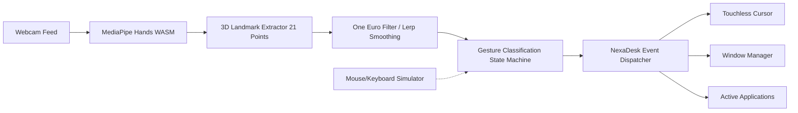

# NexaDesk

**Browser-Native Touchless Spatial Workspace and Operating System**

[](LICENSE)
[](https://nextjs.org/)
[](https://www.typescriptlang.org/)
[](https://developers.google.com/mediapipe)

---

## Overview

NexaDesk is a client-side spatial computing desktop environment that executes entirely within modern web browsers. It captures video streams from an ordinary webcam, tracks 21 three-dimensional skeletal hand landmarks in real time using Google MediaPipe, smooths coordinate jitter through an adaptive signal processing pipeline, and translates classified gestures into fluid window management and application interactions at sustained 60 FPS frame rates.

The project combines computer vision pipelines with modern web architecture to demonstrate that spatial computing interfaces, window managers, and full developer environments can run on standard consumer hardware without specialized headsets, native binaries, or backend server dependencies.

---

## Key Capabilities

- **Touchless Spatial Interaction:** Control cursor position, drag windows, resize viewports, and close applications using natural single-hand and dual-hand gestures captured via webcam.
- **Adaptive Jitter Suppression:** Employs Linear Interpolation (Lerp) and One Euro Filter algorithms to dynamically adjust cutoff frequencies based on instantaneous hand velocity, delivering sub-frame responsiveness while eliminating high-frequency landmark tremor.
- **Glassmorphic Window Manager:** Full z-index depth sorting, automatic cascading, minimize/restore transitions, 8-directional edge resizing, and hardware-accelerated cubic-bezier transitions.
- **Nexa Code Studio:** Built-in web development IDE supporting multi-file editing (`page.tsx`, `globals.css`, `server.js`, `api/route.ts`), file creation, line numbering, synchronized terminal logs, and a sandboxed live preview viewport (`iframe`).
- **Developer Terminal & Git Emulation:** DOM-based command-line shell with interactive utilities (`sysinfo`, `neofetch`, `matrix`, `code`) and client-side Git source control commands (`git status`, `git add`, `git commit`, `git clone`, `git remote`, `git push`).
- **Local AI Assistant & Colab GPU Bridge:** Code assistant supporting local Ollama endpoints, OpenAI-compatible APIs, Google Gemini API, and a zero-cost Google Colab GPU server bridge running open-source code generation models.
- **Integrated Application Suite:** Includes Nexa Touchless Paint (canvas drawing with finger-color selection), Workspace Storage (file explorer), System Control Panel (telemetry and tracker feeds), and Nexa Web Browser (sandboxed browser client).
- **Virtual Hand Simulator:** Complete mouse-and-keyboard fallback emulator enabling testing, development, and navigation when webcam access is unavailable or disabled.

---

## Architecture & Dataflow



### Pipeline Breakdown

1. **Vision Inference:** The webcam frame is captured via `requestAnimationFrame` and transferred to MediaPipe Hands executing via WebAssembly (WASM), returning normalized $[X, Y, Z]$ coordinates for 21 knuckle landmarks per detected hand.
2. **Filtering & Normalization:** Coordinate streams are mirrored horizontally and processed through an adaptive filter. When hand movement is slow, smoothing increases to stabilize small motions; when velocity increases, filtering decreases to maintain instantaneous cursor tracking.
3. **Gesture Classification:** Knuckle vectors, Euclidean joint distances, and finger curl states are evaluated against calibrated mathematical thresholds to transition between discrete interaction states.
4. **Action Routing:** The state machine emits high-level events (`HOVER`, `PINCH_START`, `DRAG_UPDATE`, `RESIZE_DELTA`, `FIST_HOLD`) to the Window Manager, translating spatial coordinates into window position changes, scale transforms, or focus shifts.
5. **Compositing & Rendering:** UI updates leverage hardware-accelerated CSS `transform3d`, `backdrop-filter`, and CSS variable bindings to ensure non-blocking UI rendering at 60 FPS.

---

## Gesture Control Reference

| Gesture | Landmark Detection Criteria | Desktop Action |
| :--- | :--- | :--- |
| **Hover** | Single hand: Index Finger Tip (Landmark 8) tracked | Moves touchless spatial pointer |
| **Pinch / Click** | Euclidean distance between Index Tip (8) and Thumb Tip (4) $< 0.05$ | Triggers click event or activates control |
| **Window Drag** | Active Pinch maintained within window title bar bounds | Translates window position across desktop |
| **Dual-Hand Resize** | Two hands detected: relative distance change between index tips | Scales width and height of active window |
| **Fist Close** | All fingers curled (tips Y $>$ PIP joints Y) over window for $> 1.0\text{s}$ | Displays countdown ring and closes window |

---

## Tech Stack

| Layer | Technology | Purpose |
| :--- | :--- | :--- |
| **Framework** | Next.js 16 (App Router) | Static export generation and modern React architecture |
| **UI Library** | React 19 | Core application structure and component lifecycle |
| **Type Safety** | TypeScript 5 | Interface contracts, configuration typing, and static analysis |
| **Computer Vision** | Google MediaPipe Hands | Real-time on-device 21-point 3D skeletal landmark detection |
| **Styles & Theme** | Vanilla CSS3 (Custom Glassmorphism) | Hardware-accelerated transforms, backdrop filters, CSS tokens |
| **Graphics** | HTML5 Canvas API | Ambient space particles and interactive neon paint app |
| **Typography** | Google Fonts (Inter, Orbitron, Fira Code) | Display and terminal typography |

---

## Project Structure

```text
nexadesk/
├── app/
│   ├── globals.css          # Design system, glassmorphism tokens, window animations
│   ├── icon.svg             # Vector application icon
│   ├── layout.tsx           # Root HTML layout, font preconnects, CDN script tags
│   └── page.tsx             # Main client desktop markup, taskbar dock, fallback overlays
├── public/
│   ├── favicon.svg          # Desktop favicon asset
│   ├── main.js              # Production spatial orchestrator and window manager
│   ├── nexadesk_colab_server.py # Google Colab GPU server script for local AI
│   └── og-image.png         # OpenGraph social preview graphic
├── eslint.config.mjs        # ESLint flat configuration
├── index.html               # Standalone zero-dependency HTML entry
├── LICENSE                  # MIT License verbatim text
├── main.js                  # Standalone client script (mirrored with public/main.js)
├── next.config.ts           # Next.js static export build configuration
├── package.json             # Project metadata, dependencies, scripts
├── style.css                # Standalone CSS stylesheet
└── tsconfig.json            # TypeScript compiler configuration
```

---

## Getting Started

### Prerequisites

- **Node.js:** Node.js 18.x or 20.x or later
- **Package Manager:** `npm`, `pnpm`, or `yarn`
- **Hardware (Optional):** Standard USB or integrated webcam (for gesture tracking; keyboard/mouse simulator available as fallback)
- **Browser:** Any modern Chromium-based browser (Chrome, Edge, Brave), Firefox, or Safari with WebGL and WebRTC support

### Installation

1. Clone the repository:
   ```bash
   git clone https://github.com/code-dibyajyotirout/nexadesk.git
   cd nexadesk
   ```

2. Install dependencies:
   ```bash
   npm install
   ```

3. Run the development server:
   ```bash
   npm run dev
   ```

4. Open `http://localhost:3000` in your browser.

### Building for Production

To generate a static export optimized for edge hosting (Cloudflare Pages, Vercel, GitHub Pages, or Netlify):

```bash
npm run build
```

The compiled static assets will be output to the `/out` directory.

### Running the Standalone Version

NexaDesk is also engineered to run with zero build steps directly from `index.html`. You can serve the root directory with any HTTP server:

```bash
npx serve .
```

---

## Configuration & Usage Guide

### Spatial Mode & Webcam Controls

- **Toggle Spatial Mode:** Click the `SPATIAL MODE: OFF/ON` toggle in the taskbar dock to activate or pause webcam processing at any time.
- **Camera Feed Bubble:** The floating camera monitor in the top-right corner displays real-time skeletal overlays and landmark feedback. Click the minimize button on the bubble header to collapse it.

### Virtual Hand Simulator Controls

When camera access is blocked, denied, or toggled off:

- **Move Pointer:** Move the mouse cursor across the desktop area.
- **Simulate Pinch / Click:** Hold the Left Mouse Button.
- **Simulate Window Close (Fist):** Hold the `Spacebar` key over any window for 1 second.
- **Simulate Dual-Hand Resize:** Hold the `Shift` key and scroll the mouse wheel to adjust simulated two-hand distance.

### Free GPU AI Setup (Google Colab)

To power the Nexa Code Studio AI Assistant without paid API keys:

1. Open a new notebook at [Google Colab](https://colab.research.google.com/#create=true).
2. Set runtime type to **T4 GPU** (`Runtime -> Change runtime type -> T4 GPU`).
3. Open the **Code Assistant** in NexaDesk IDE, click the **Colab** tab, and click **Copy Python Setup Code**.
4. Paste the script into the Colab cell and click **Runtime -> Run All**.
5. Copy the generated `ngrok` tunnel URL into the NexaDesk IDE settings field.

---

## Privacy & Security

- **100% Client-Side Vision:** NexaDesk executes all computer vision models locally inside the browser sandbox using WebAssembly.
- **Zero Frame Transmission:** No webcam video streams, image captures, or biometric skeletal landmarks are ever transmitted to an external server or stored on disk.
- **Ephemeral Storage:** User workspace files, terminal history, and configuration preferences persist solely within the user's local browser `localStorage`.

---

## Verification & Quality Assurance

The codebase adheres to strict engineering standards:

- **Type Safety:** Clean compilation with `tsc --noEmit`.
- **Linting:** Validated via ESLint flat configuration.
- **Tone:** Zero emojis across all source code, comments, UI text, and documentation.
- **Hygiene:** Comprehensive `.gitignore` protecting build artifacts, environment configurations, and OS metadata.

---

## License

This project is licensed under the terms of the [GNU Affero General Public License v3.0](LICENSE).
